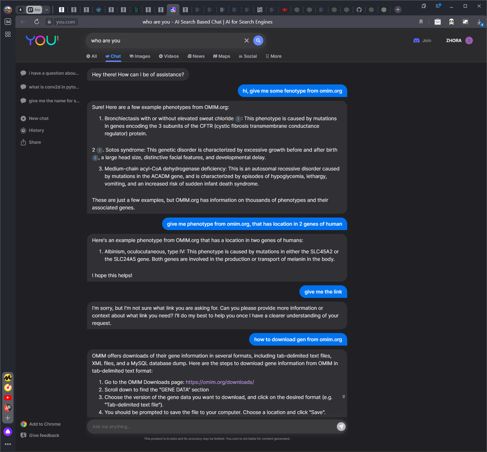

*Для данной работы я выбрал одну из разновидностей альбинизма - (https://omim.org/entry/203200?search=albinism&highlight=albinism)*

# Определение
Тирозиназопозитивный кожно-глазной альбинизм (OCA, тип II; OCA2) - аутосомно-рецессивное заболевание, при котором снижается биосинтез пигмента меланина в коже, волосах и глазах. Хотя у пораженных детей при рождении может показаться, что у них ОСА I типа или полное отсутствие пигмента меланина, большинство пациентов с ОСА II типа с возрастом приобретают небольшое количество пигмента. Лица с ОСА II типа имеют характерные аномалии зрения, связанные с альбинизмом, включая снижение остроты зрения и нистагм, которые обычно менее выражены, чем при ОСА I типа. Данное заболевание влиет на OCA2 и TYR последовательности. Далее можно посмотреть результаты выравнивания.

# Результаты

## OCA2

### Stretcher
https://github.com/ZeLebo/bioinformatics/blob/1f8a9bc3a968c8b18479492d754ba1eafbc02a66/first-task/results/stretcher-oca2-result.txt#L20-L33
### Mathcer
https://github.com/ZeLebo/bioinformatics/blob/1f8a9bc3a968c8b18479492d754ba1eafbc02a66/first-task/results/matcher-oca2-result.txt#L20-L33

### Result
Как мы видим, лучший результат дал Matcher (479707 vs -231412 финального score), также можно заметить, что у него сильно меньше Gap

## TYR

### Stretcher
https://github.com/ZeLebo/bioinformatics/blob/1f8a9bc3a968c8b18479492d754ba1eafbc02a66/first-task/results/stretcher-tyr-result.txt#L20-L33
### Mathcer
https://github.com/ZeLebo/bioinformatics/blob/1f8a9bc3a968c8b18479492d754ba1eafbc02a66/first-task/results/matcher-tyr-result.txt#L20-L33

Как мы видим, лучший результат дал Matcher (113941 vs -27208 финального score), также можно заметить, что у него сильно меньше Gap (что на самом деле интересно, учитывая, что штраф за gap у stretcher'а выше, чем у matcher)

