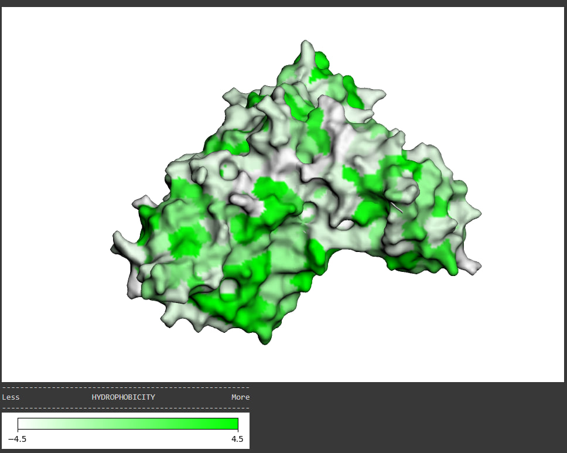
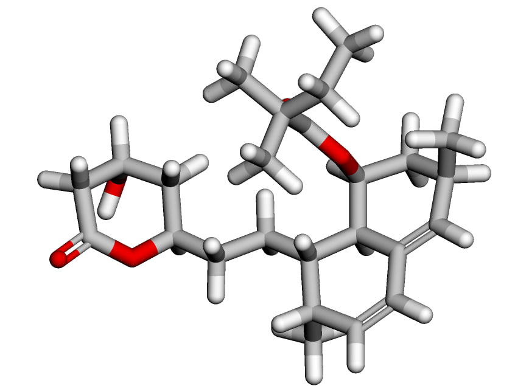
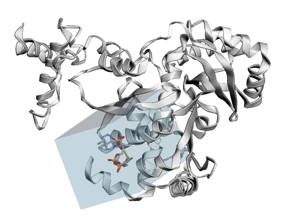
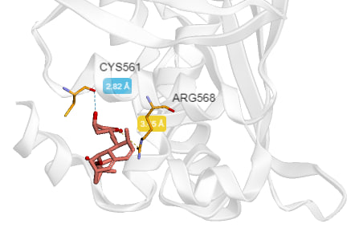
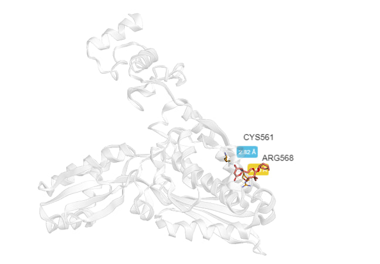

## Информация о препарате
[Источник, ну выглядит как реклама](https://lib.medvestnik.ru/apps/lib/assets/uploads/pharmateca/PDF/7504.pdf#:~:text=Симвастатин%20блокирует%20активность%20фермента%20ГМГ-КоА,в%20синтезе%20молекулы%20холестерина%20(ХС))
### Действующее вещество
   
**Simvastatin (Симвастатин)** - препарат, относится к классу статинов, 
который используется для снижения уровня холестерина в крови. 
Он является ингибитором HMG-CoA-редуктазы, фермента, участвующего в синтезе холестерина в печени. 
Препарат представляет собой про-препарат, который в организме превращается в активную форму. 
### Область применения

1. Общее снижение уровня общего холестерина, LDL-холестерина(это который нехороший), 
триглицеринов в крови. Также повышает уровень HDL-холестерина(этот типа хороший).
2. Профилактика сердечно-сосудистых заболеваний, таких как инфаркт миокарда и инсульт, 
у пациентов с высоким риском ишемических заболеваний сердца.
3. Препарат эффективен при различных формах гиперхолестеринемии.
4. Лечение артериосклероза, профилатика увеличения размеров атеросклеротических бляшек.
### Молекулярный механизм действия
Симвастатин блокирует активность фермента ГМГ-КоФ (3-гидрокси-3-метилглутарил-коэнзим) А-редуктазы.
По принципу конкурентного антагонизма молекула симваститина связывается с той частью рецептора коэнзима А, 
где прикрепляется этот фермент. 

Другая часть молекулы статина ингибирует процесс превращения гидроксиметилглутарата в мевалонат - 
промежуточный продукт в синтезе молекулы холестерина (ХС). 

Таким образом, симвастатин блокирует синтез ХС.
В результате снижения внутриклеточного содержания ХС печеночная клетка увеличивает число мембранных рецепторов к 
липопротеидам низкой плотности (ЛПНП) на своей поверхности, которые связывают и выводят из кровотока ЛПНП, уменьшая таким образом концетрацю ХС в крови.
При этом снижаются концентрации ХС, ЛПНП, триглицеринов и повышается уровень липопротеидов высокой плотности.

## Полученный ноутбук + Docking

- Ноутбук -> [большой colab file](Notebook.ipynb)
- Docking -> [большая папка с подпапками](Docking/)
- Docking -> [полученные SIM.pdb'ы](Docking/1DQA/DOCKING/SIM)

## Картинки
### Трехмерная структура подготовленного таргета

### Трехмерная структура исходного лиганда

### Полученный бокс

### Полученный докинг

