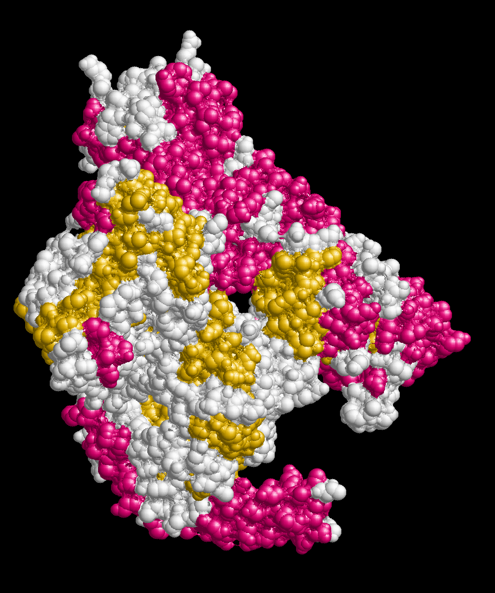

# Вводная инфа
Название: 8g05

Источник: (https://www.rcsb.org/structure/8G05)

# Изображения белка
## Wireframe

## Backbone

## Spacefill

## Ribbons

## Molecular surface

## Цветовая модель CPK

## Раскраска по доменам

# Описание получения визуализации

1. Загружаем продукт с официального сайта
2. Открываем приложение (запускается 2 окна: GUI и терминал)
3. В терминале пишем `load <path-to-file>`
	
	
4. В GUI видим изображение белка
5. В верхней панели выбираем нужные параметры
	
	
	
    
	
# Изображение белка публикационного качества
- Приложение не хочет давать картинку, потому что она слишком большая
	
    

- Получается экспортировать в форматах `PIC` и `RGB`
	- PIC - (test.pic)
	- RGB - (test.rgb)
