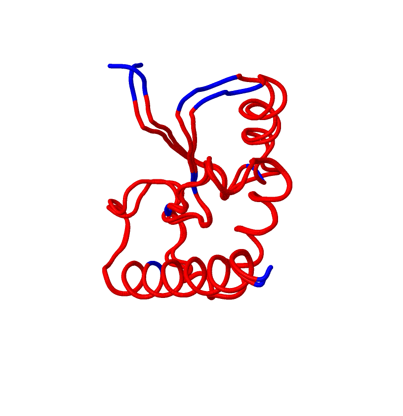
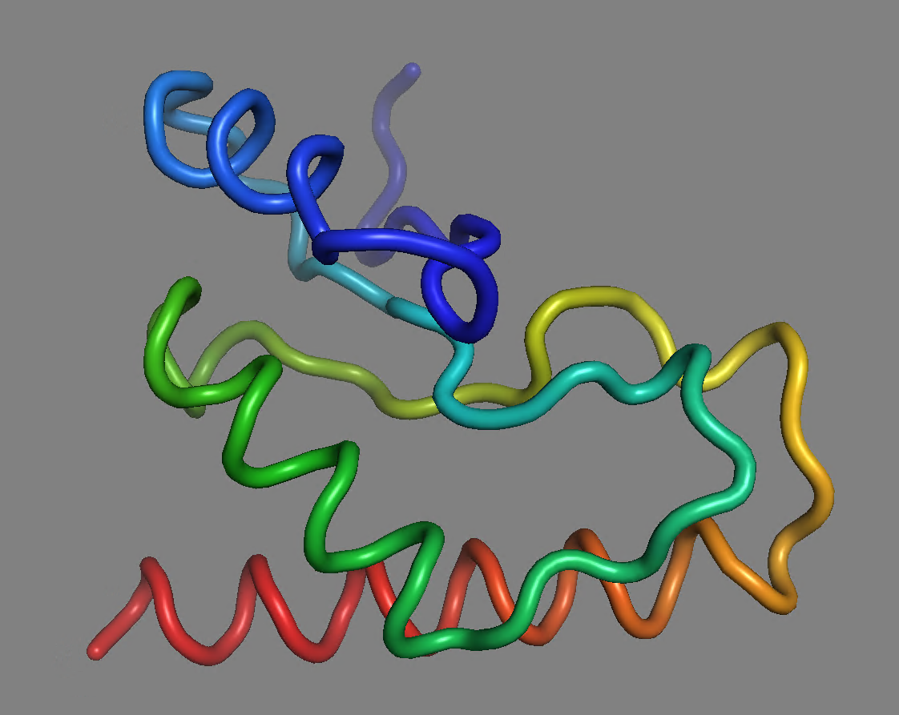
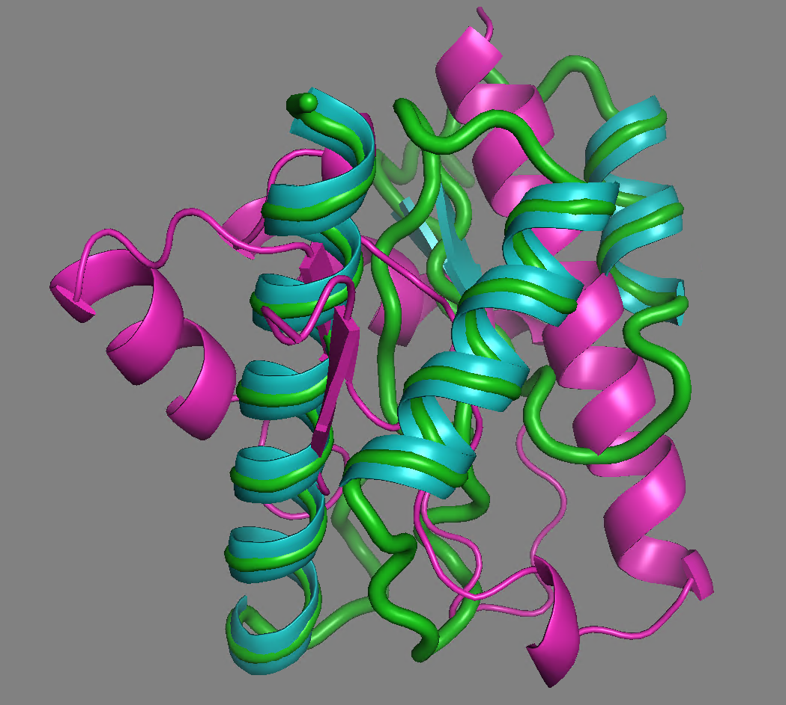
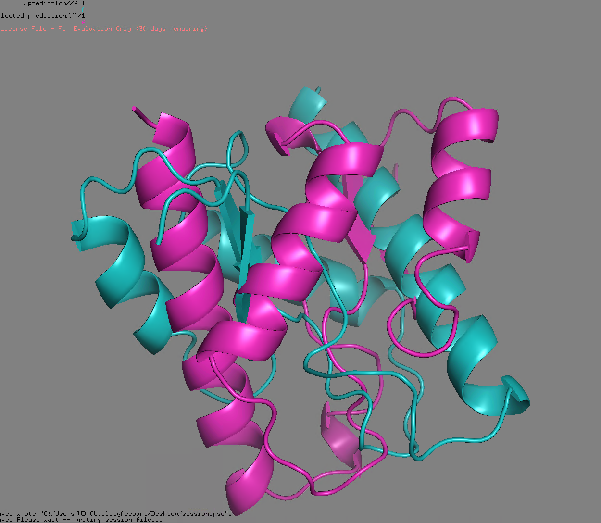
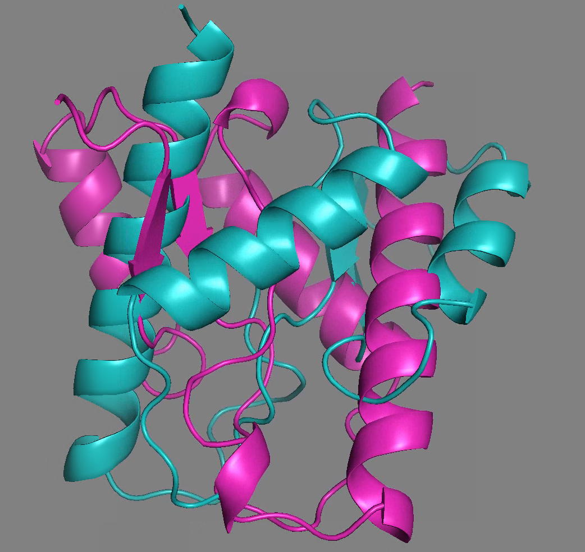

1. **Последовательность, названия программ-предсказателей и программы-выравнивателя:**

    - Первичная последовательность белка: `MDADVISFEASRGDLVVLDAIHDARFETEAGPGVYDIHSPRIPSEKEIEDRIYEILDKIDVKKVWINPDCGLKTRGNDETWPSLEHLVAAAKAVRARLDK`
    - Инструмент 1 фолдинга: `ESMFold` [collab](https://colab.research.google.com/github/sokrypton/ColabFold/blob/main/ESMFold.ipynb#scrollTo=boFQEwsNQ4Qt)
    - Инструмент 2 фолдинга: `OpenFold` [collab](https://colab.research.google.com/github/sef43/openfold/blob/main/notebooks/OpenFold.ipynb)
    - Инструмент парного выравнивания: `ProBiS`

2. **Полученные ноутбуки с предсказанной структурой**
      - [ESMFold](ESMFold/ESMFold.ipynb)
      - [OpenFold](OpenFold/OpenFold.ipynb)
   
3. **Полученные предсказания структур в формате PDB**
      - [ESMFold](ESMFold/prediction.pdb)
      - [OpenFold](OpenFold/selected_prediction.pdb)
   
4. **Полную выдачу программы выравнивания в виде PDB или иного формата, а также все логи и сопутствующие файлы**

      Файлы, которые генерирует сайт можно посмотреть тут -> [папка](ProBiS)

      картинка:
   
      
5. **Проект/сессию/иное из программы визуализации:**

      Сохранненая сессия - [session](session.pse)

6. **Снимки экрана \ запись видео с полученным раскрашенным выравниванием** 

   

   Зеленым цветом - выровненная последовательность

   Голубым цветом - ESMFold

   Фиолетовым цветом - OpenFold
   
   

   Если убрать выровненную последовательность, то видно, что

   
   

7. **Краткие выводы о совпадении полученных предсказаний в свободной форме.**

   Для предсказания использовались разные нейронные сети, поэтому неудивительно, что результаты не совпадают идеально.
   При изучении полученных результатов, можно заметить, что структуры крайне схожи между собой, но повернуты в пространстве относительно друг друга на градус.
   Поэтому выравнивание выглядит так некрасиво, если просто смотреть на результаты предсказаний, видно, что глобально - они одинаковые.
   