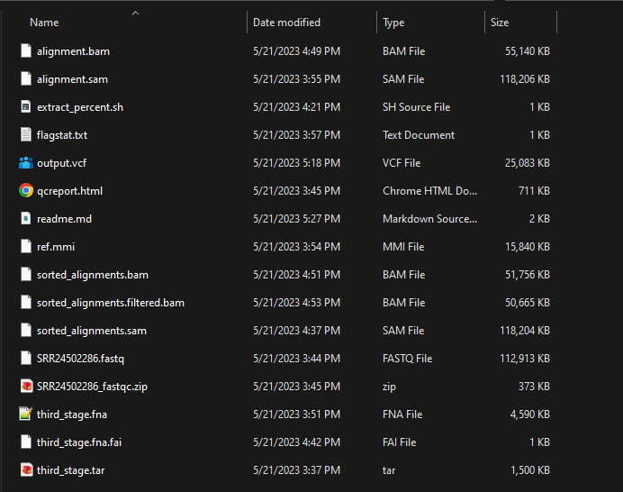
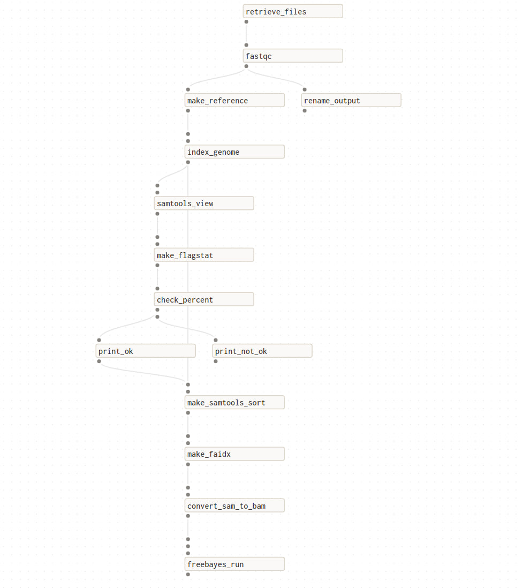

# Result of work

# Table of contents
1. [Работаем с командной строкой](#делаем-пайплайн-руками-в-терминале)
2. [Результат flagstat](#результат-flagstat--он-был-выше-но-я-продублирую-)
3. [Bash-script для кое-какой автоматизации](#напишем-bash-скрипт-для-всей-последовательности-сверху)
4. [Создание нового проекта на Dagster](#создаем-новый-проект-с-помощью-dagster)
5. [Первая программа](#первая-программа-hello-world)
6. [Реализуемая программа](#реализуемая-программа)
7. [Визуализация пайплайна](#visualisation-of-pipeline)

### Ссылка на ген
   E.coli link - [link to run](https://www.ncbi.nlm.nih.gov/sra/SRX20287202[accn])

### Много файлов


### Делаем пайплайн руками в терминале

1. Скачиваем данные
2. Запускаем `fastqc` команду на fastqc файле
    ```bash
    fastqc SRR24502286.fastq
    mv *.html qcreport.html
    ```
3. Индексируем геном
    ```bash
    minimap2 -d <prefix.mmi> <reference.fasta>
    minimap2 -d ref.mmi third_stage.fna

    # indexing with reference
    minimap2 -a ref.mmi SRR24502286.fastq > alignment.sam
    ```
4. Выполняем команду samtools view
    ```bash
    samtools view alignment.sam
    ```
5. Генерируем файл через команду
    ```bash
    samtools flagstat alignment.sam > flagstat.txt
    ```
   [result](pishem_ruchkami/flagstat.txt)
6. Небольшой bash-скрипт, чтобы вытаскивать процент из файла
    ```bash

    #!/bin/bash

    # Get the filename from the command line argument
    filename=$1

    # Use grep and sed to extract the percent value
    percent=$(grep -o -P '\d+\.\d+%' $filename | sed 's/%//')

    # trim the first one
    first=$(echo $percent | cut -f1 -d' ')

    echo "Percent is $first%"

    result="BAD"

    if (( $(awk 'BEGIN {print ("'$first'" > "90.0")}') )); then 
        result="OK ✅✅✅"
    else
        result="BAD ❌❌❌"
    fi

    echo $result

    ```
7. Сортируем последовательность
    ```bash
    samtools sort -o sorted_alignment.sam alignment.sam
    ```
8. Делаем .fai файл самостоятельно (а то мало ли)
    ```bash
    samtools faidx third_stage.fna
    ```
9. Конвертируем .sam файл в .bam для дальнейшей генерации вариантов генов
   ```bash
   samtools view -bS -o alignment.bam alignment.sam
   # sort again, but for bam
   samtools sort -o sorted_alignments.bam alighment.bam
   ```
10. Запускаем freebayes
    ```bash
    freebayes -f third_stage.fna sorted_alignments.filtered.bam > output.vcf
    ```
    
### Результат flagstat (он был выше, но я продублирую)
   ```text
    15644 + 0 in total (QC-passed reads + QC-failed reads)
    13760 + 0 primary
    1269 + 0 secondary
    615 + 0 supplementary
    0 + 0 duplicates
    0 + 0 primary duplicates
    14907 + 0 mapped (95.29% : N/A)
    13023 + 0 primary mapped (94.64% : N/A)
    0 + 0 paired in sequencing
    0 + 0 read1
    0 + 0 read2
    0 + 0 properly paired (N/A : N/A)
    0 + 0 with itself and mate mapped
    0 + 0 singletons (N/A : N/A)
    0 + 0 with mate mapped to a different chr
    0 + 0 with mate mapped to a different chr (mapQ>=5)
   ```
### Напишем bash-скрипт для всей последовательности сверху

Код самого скрипта -> [bash script](./bash_script/manual.sh).

Важно: до того как запускать скрипт нужно установить зависимости в систему
```bash
    sudo apt-get install samtools, minimap2, fastqc
```

### Создаем новый проект с помощью Dagster
Для начала нужно установить dagster в систему
```bash
    pip3 install dagster dagit
```
После этого можно инициализировать новый проект
```bash
    dagster project scaffold --name <name-of-your-project>
```
После этого переходим в созданную папку и ищем setup.py файл:
```python
from setuptools import find_packages, setup

setup(
    name="dagster_pipeline",
    packages=find_packages(exclude=["dagster_pipeline_tests"]),
    install_requires=[
        "dagster",
        "dagster-cloud"
    ],
    extras_require={"dev": ["dagit", "pytest"]},
)
```
В секции `install_requires=[]` можно добавить необходимые компоненты для дальнейшей работы кода.

Чтобы установить все зависимости можно воспользоваться коммандой:
```bash
    pip3 install -e ".[dev]"
```
### Первая программа `hello world`

В коде вы можете декорировать фукнции с помощью 2 декораторов:
- `@op` - аннотация для обозначения минимальной логической ноды в последовательности действий (Unit)
- `@job` - аннотация для обозначения функций, которые будут выполнять несколько `@op's`

Теперь создадим новый файл `say_hello_pipeline.py` в <name-of-your-project> папке и напишем в него следующее содержимое:
```python
from dagster import job

@job
def say_hello():
    print(f"Hello world from Dagster!")

if __name__ == '__main__':
    say_hello()
```
Чтобы запустить этот код можно воспользоваться этой командой:
```bash
  dagster job execute -f <name-of-your-project>/say_hello_pipeline.py > output.txt
```
Тут можно найти логи вывода этой команды: [output.txt](dagster-pipeline/output.txt)

Важно: при обозначении дефолтного значения входных параметров фукнции через `None` может возникнуть ошибка, поэтому вместо такого кода 
```python
def foo(name = None): # it will fail at start due to NoneClass Exception
    if name is None:
      name = "aaa"
    ...
```
Лучше написать такой
```python
def foo(name="aaa"):
    ...
```
### Реализуемая программа
Код `pipeline` можно посмотреть тут -> [code](dagster-pipeline/dagster_pipeline/pipeline.py)

Результат работы можно найти тут -> [result in vcf format](dagster-pipeline/dagster_pipeline/output.vcf)

Логи выполнения работы тут -> [logs of running command](dagster-pipeline/dagster_pipeline/logs.txt)

Для запуска и получения результата запустите следующую команду:
```bash
   cd dagster-pipeline/dagster_pipeline
   dagster job execute -f pipeline.py
```

### Visualisation of pipeline
Чтобы визуализировать пайплайн можно запустит команду:
```bash
   dagit -f <name-of-your-file>.py
```
И перейти на `localhost:3030`

У меня получился следующий результат:



(Dagster сам может сгенерировать последовательность выполнения `op`, которые можно найти во вкладке `jobs`)

Dagster строит дерево на основании передаваемых результатов между функциями, а не на основании стека их вызовов, поэтому если написать такой код
```python
@job
def foo():
    retrieve_files()
    fastqc()
    rename_output()
    make_reference()
    index_genome()
    samtools_view()
    make_flagstat()
```
Вы получите несвязанные ноды в графе.

Чтобы получить свои связи в нодах, нужно передавать значения между функциями (примерно так):
```python
@job
def foo():
    data = retrieve_files()
    data1 = fastqc(data)
    rename_output(data1)
    data2 = make_reference(data1)
    alignment_sam = index_genome(data2)
    bam_alignment = samtools_view(alignment_sam)
    flagstat_file = make_flagstat(bam_alignment)
    ok, not_ok = check_percent(flagstat_file)
    ok1 = print_ok(ok)
    print_not_ok(not_ok)
```
Так как блоки связываются описанным выше способом, задача становится больше креативной.

Можно даже использовать некоторые "грязные хаки": функции в питоне по дефолту возвращают `None`, поэтому его можно использовать как результат выполнения функций и передавать дальше, чтобы строить граф.

Среди отличий от схемы можно выделить другие имена нод, потому что они берутся из имен функций в python